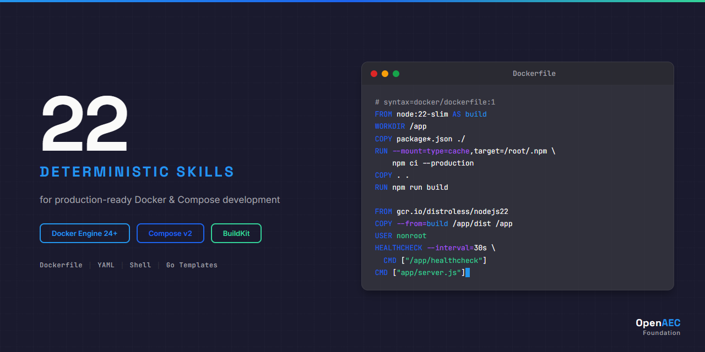

# Docker & Docker Compose Skill Package for Claude

<p align="center">
  
</p>

> Deterministic, research-verified skills for Docker Engine 24+ and Docker Compose v2 — built for Claude Code.

[](LICENSE)
[](INDEX.md)
[](https://docs.docker.com)
[](https://docs.docker.com/compose/)
[](https://github.com/OpenAEC-Foundation)

---

## What is this?

A curated collection of **22 deterministic skills** that teach Claude how to write, review, and debug Docker configurations. Every skill is verified against official Docker documentation — no hallucinated APIs, no vague advice.

### Who is this for?

- **Developers** who want Claude to write production-grade Dockerfiles and Compose files
- **DevOps engineers** who want Claude to understand container orchestration patterns
- **Teams** adopting Docker who want consistent, security-aware container configurations
- **Open-source LLM users** who need structured Docker knowledge for less capable models

---

## Skill Categories

| Category | Count | Covers |
|----------|-------|--------|
| **core/** | 3 | Architecture, security hardening, networking fundamentals |
| **syntax/** | 7 | Dockerfile instructions, BuildKit features, multi-stage builds, Compose services & resources, CLI commands |
| **impl/** | 6 | Build optimization, production patterns, storage, CI/CD, Compose workflows, Go templates |
| **errors/** | 4 | Build failures, runtime errors, networking issues, Compose troubleshooting |
| **agents/** | 2 | Dockerfile/Compose validation and generation |

**[Full skill catalog &rarr;](INDEX.md)**

---

## Installation

### Claude Code (recommended)

Add to your project's `.claude/settings.json`:

```json
{
  "skills": {
    "docker": {
      "source": "github:OpenAEC-Foundation/Docker-Claude-Skill-Package"
    }
  }
}
```

### Manual

Clone and reference skills directly:

```bash
git clone https://github.com/OpenAEC-Foundation/Docker-Claude-Skill-Package.git
```

Then reference skills from `skills/source/docker-*/` in your Claude project configuration.

---

## Technology Coverage

| Technology | Version | Skills |
|-----------|---------|--------|
| Docker Engine | 24+ | All skills |
| Docker Compose | v2 | syntax-compose-\*, impl-compose-\* |
| BuildKit | Default in 24+ | syntax-buildkit, impl-build-optimization |
| Docker Scout | Latest | core-security |
| Go Templates | — | impl-go-templates |

---

## Skill Structure

Each skill follows a consistent format:

- **SKILL.md** — Main skill file (<500 lines) with Quick Reference, Decision Trees, Patterns, Critical Warnings
- **references/** — Extended content: detailed API references, code examples, anti-pattern catalogs

### Quality Standards

- All content in English with deterministic ALWAYS/NEVER language
- All code examples verified against official Docker documentation
- Every SKILL.md under 500 lines — heavy content in references/
- YAML frontmatter with trigger-word-rich descriptions
- Complete anti-pattern catalogs for every skill
- All Dockerfile examples buildable, all Compose files pass `docker compose config`

---

## Documentation

| Document | Purpose |
|----------|---------|
| [INDEX.md](INDEX.md) | Complete skill catalog with descriptions |
| [REQUIREMENTS.md](REQUIREMENTS.md) | Quality guarantees and per-area requirements |
| [DECISIONS.md](DECISIONS.md) | Architectural decisions with rationale |
| [SOURCES.md](SOURCES.md) | Official documentation sources |
| [WAY_OF_WORK.md](WAY_OF_WORK.md) | 7-phase methodology and skill standards |
| [CHANGELOG.md](CHANGELOG.md) | Version history |

---

## Methodology

This package follows the **7-phase research-first development methodology** proven across multiple OpenAEC Foundation skill packages:

1. **Infrastructure & Planning** — Repository setup, core files, protocols
2. **Research (Vooronderzoek)** — Broad technology research and gap analysis
3. **Masterplan & Skill Design** — Skill inventory, dependencies, batch planning
4. **Topic Research** — Deep per-skill research with source verification
5. **Skill Development** — Batch creation with quality gates
6. **Validation & Quality** — Full quality audit against requirements
7. **Publication** — GitHub release with documentation and branding

---

## Contributing

This package follows the [7-phase research-first methodology](WAY_OF_WORK.md). Contributions must:

1. Reference official Docker documentation (see [SOURCES.md](SOURCES.md))
2. Use deterministic language (ALWAYS/NEVER)
3. Keep SKILL.md under 500 lines
4. Include references/ with examples and anti-patterns
5. Target Docker Engine 24+ and Compose v2

See [REQUIREMENTS.md](REQUIREMENTS.md) for full quality standards.

---

## Related Packages

| Package | Skills | Technology |
|---------|--------|-----------|
| [ERPNext Skill Package](https://github.com/OpenAEC-Foundation/ERPNext_Anthropic_Claude_Development_Skill_Package) | 28 | ERPNext / Frappe Framework |
| [Blender-Bonsai Skill Package](https://github.com/OpenAEC-Foundation/Blender-Bonsai-ifcOpenshell-Sverchok-Claude-Skill-Package) | 73 | Blender, Bonsai, IFC |
| [Tauri 2 Skill Package](https://github.com/OpenAEC-Foundation/Tauri-2-Claude-Skill-Package) | 27 | Tauri 2.x (Rust + TypeScript) |

---

## Companion Skills: Cross-Technology Integration

> **[Cross-Tech AEC Integration Skills](https://github.com/OpenAEC-Foundation/Cross-Tech-AEC-Claude-Skill-Package)** — 15 skills for technology boundaries

| Skill | Boundary | What it adds |
|-------|----------|-------------|
| `crosstech-impl-docker-aec-stack` | Docker ↔ AEC services | IfcOpenShell containers, Speckle Server deployment, QGIS Server, web-ifc workers |
| `crosstech-impl-n8n-aec-pipeline` | n8n ↔ Docker | Containerized AEC automation pipelines |

---

## License

[MIT](LICENSE) — Copyright (c) 2026 [OpenAEC Foundation](https://github.com/OpenAEC-Foundation)
